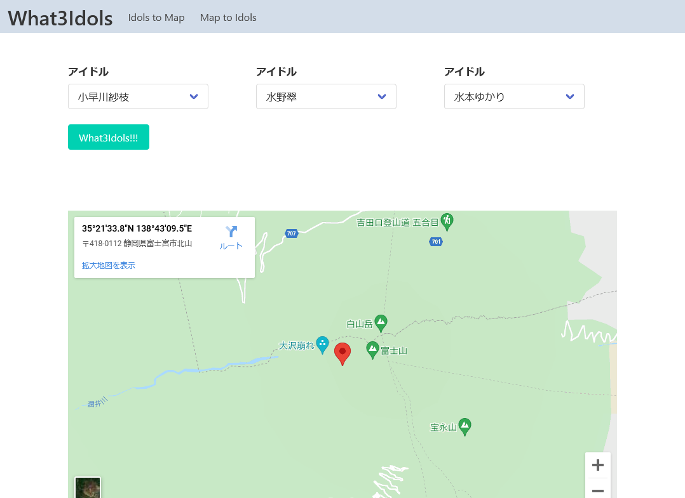

# What 3 Idols!

> アイドルで位置情報を伝える


[](https://circleci.com/gh/YutaGoto/what3idols/tree/main)
[](https://github.com/YutaGoto/what3idols/actions)


## Getting Started

Set environment variables:

```
cp .env.example .env.local
```

First, run the development server:

```bash
yarn dev
```

Open [http://localhost:3000](http://localhost:3000) with your browser to see the result.


